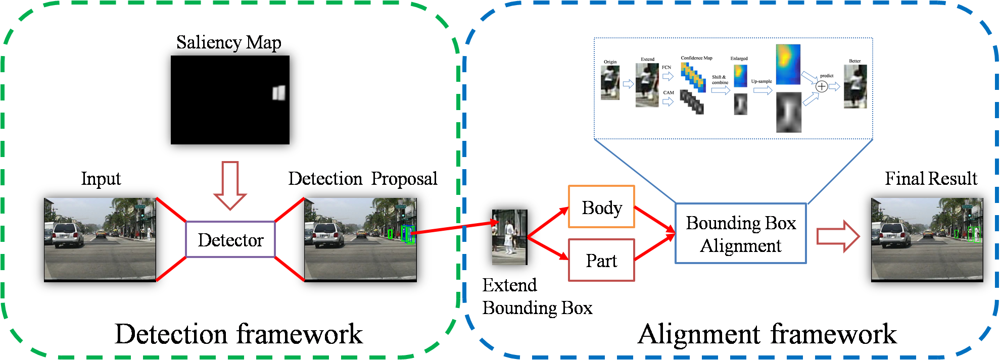
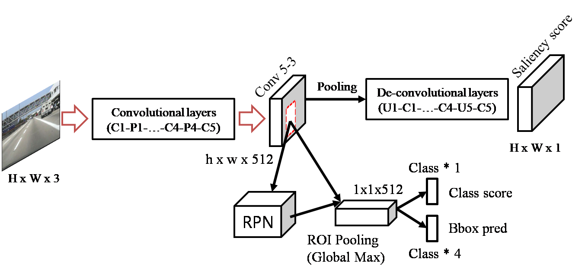
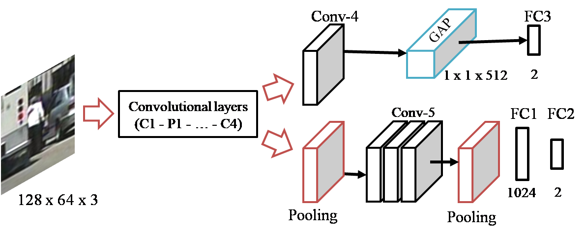

# Part-Level Convolutional Neural Networks for Pedestrian Detection Using Saliency and Boundary Box Alignment

Abstract
--------
Pedestrians in videos have a wide range of appearance factors such as body poses, occlusions, and complex backgrounds, which make their detection difficult. Moreover, a proposal shift problem causes the loss of body parts such as head and legs in pedestrian detection, which further degrades the detection accuracy. In this paper, we propose part-level convolutional neural networks (CNNs) for pedestrian detection using saliency and boundary box (BB) alignment. The proposed network consists of two subnetworks: detection and alignment. In the detection subnetwork, we use saliency to remove false positives such as lamp posts and trees by combining fully convolutional network (FCN) and class activation map (CAM) to extract deep features. Subsequently, we adopt the BB alignment on detection proposals in the alignment subnetwork to overcome the proposal shift problem by applying the part-level CNN to recall the lost body parts. Experimental results on various datasets demonstrate that the proposed method remarkably improves
accuracy in pedestrian detection and outperforms existing state-of-the-art techniques.

Contribution Highlights
-----------------------
- We use saliency in the detection subnetwork to remove background components such as lamp posts and trees from pedestrians.
- We combine FCN and CAM into the alignment subnetwork to enhance the resolution of confidence maps and successfully recall the lost body parts.

Images
------
- Whole framework of the proposed method. The proposed pedestrian network consists of two subnetworks: detection
and alignment.

 

- Architecture of the proposed detection subnetwork.

 

- Network architecture of the proposed part-level detector based on VGG-16 network with class activation map

 

Results
--------
Detection results for [Caltech](https://github.com/iyyun/Part-CNN/blob/master/results/USA/dt-RCNN-OPT-SAL-SH-P.mat), [ETH](https://github.com/iyyun/Part-CNN/blob/master/results/ETH/dt-RCNN-OPT-SAL-SH-P.mat), and [INRIA](https://github.com/iyyun/Part-CNN/blob/master/results/INRIA/dt-RCNN-OPT-SAL-SH-P.mat) datasets can be download.

[embed]https://github.com/iyyun/Part-CNN/blob/master/images/ETHRocReasonable.pdf [/embed]

  
Download trained networks
-------------------------
- [Caltech-USA](http://dspl.skku.ac.kr/home_course/data/part-cnn/model/usa/caltech-usa.zip)
- [Part-cls](http://dspl.skku.ac.kr/home_course/data/part-cnn/model/part.zip)

Citation
--------
If you use pedestrian detection result, please cite the following [paper](https://arxiv.org/abs/1810.00689)
  
  @article{yun2018part,
    title={Part-Level Convolutional Neural Networks for Pedestrian Detection Using Saliency and Boundary Box Alignment},
    author={Yun, Inyong and Jung, Cheolkon and Wang, Xinran and Hero, Alfred O and Kim, Joongkyu},
    journal={arXiv preprint arXiv:1810.00689},
    year={2018}
  }

  

